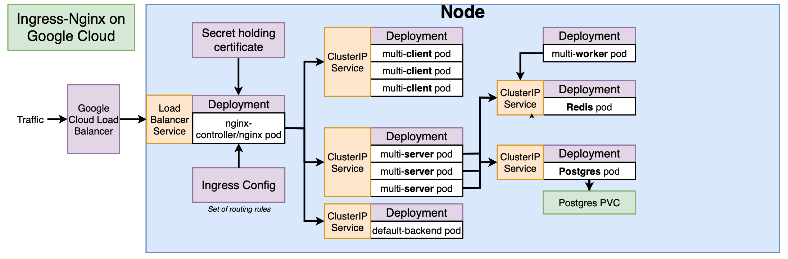

# Kubernetes configuration
This directory contains all of the kubernetes configuration files. These are used to deploy the applications to a kubernetes cluster.

You can either deploy files a single file at a time using `kubectl apply -f k8s/<file>.yaml` or the entire directory using `kubectl apply -f k8s`

Each item in the diagram above requires it's own file.
* A `Deployment` defines the template used to deploy a Pod and can result in one or more pods (replicas) being created.
* A `ClusterIP` Service defines ports to be opened allowing traffic to be directed into each pod in a deployment. A selector (tag) is used to identify which pods the ClusterIP service connects to.
* A `PersistentVolumeClaim` makes available an amount of storage which can then be claimed by a Pod. Usually pod storage is ephemeral (deleted when the pod stops or is restarted). A persistent volume allows this storage to be maintained until the cliam is deleted.
* `Ingress` defines the rules for directing inbound http traffic to specific ClusterIP services. This will route the traffic to a pod that is exposed by that service on the given port.
* A `ClusterIssuer` defines an issueing service for x509 certificates.
* A Certificate defines a certificate to be requested from a `ClusterIssuer`

Before you deploy this project there are some pre-requisites that must be met:

* A secret must be defined for pgpassword
* The NGINX ingress service must be deployed to the kubernetes cluster
* The Cert Manager service must be deployed to the kubernetes cluster

## Creating a secret
This project requires a password be created for the postgres user that is shared with the express server.

Rather than having a password stored in config files in plain text, Kubernetes has the concept of secrets. By creating a secret in an imperative way (rather than declarative), we run a single command once that stores our secret into the cluster and there is no plaintext record of it.

The command for creating a secret is

    kubeclt create secret generic <secret_name> --from-literal <key>=<value>

You scan store multiple key value pairs in a single secret. For this project we need a secret called pgpassword with a key of PGPASSWORD like so:

    kubectl create secret generic pgpassword --from-literal PGPASSWORD=<secret>

To verify the secret was created successfully you can run `kubectl get secrets`

## Helm
Helm is like a package manager for kubernetes. We're going to use it to install various librarys we want to take advantage of in our project.

To install helm v3 run the following commands

    curl https://raw.githubusercontent.com/helm/helm/master/scripts/get-helm-3 > get_helm.sh
    chmod 700 get_helm.sh
    ./get_helm.sh

## Ingress
In this project we're using ingress-nginx for ingress routing.

github.com/kubernetes/ingress-nginx

### Installation the manual way
*Note: Follow the [installation guide](https://kubernetes.github.io/ingress-nginx/deploy/) for up to date steps / versions*

First there is a manditory command for all deployments:

    kubectl apply -f https://raw.githubusercontent.com/kubernetes/ingress-nginx/nginx-0.28.0/deploy/static/mandatory.yaml

Next use the deployment method most appropriate to your local kubernetes setup

#### Docker for Desktop
    kubectl apply -f https://raw.githubusercontent.com/kubernetes/ingress-nginx/nginx-0.28.0/deploy/static/provider/cloud-generic.yaml

#### minikube
    minikube addons enable ingress

### Installation using helm
NGINX Ingress controller can be installed via Helm using the chart stable/nginx-ingress from the official charts repository. To install the chart with the release name my-nginx:

    helm install stable/nginx-ingress --name my-nginx

If the kubernetes cluster has RBAC enabled, then run:

    helm install stable/nginx-ingress --name my-nginx --set rbac.create=true

## Install [Cert Manager](https://cert-manager.io)
First apply the `CustomResourceDefinition` resources

    kubectl apply --validate=false -f https://raw.githubusercontent.com/jetstack/cert-manager/release-0.11/deploy/manifests/00-crds.yaml

Then create the cert-manager namespace

    kubectl create namespace cert-manager

Add the Jetstack Helm repository and update your local Helm chart repository cache.

> Warning: It is important that this repository is used to install cert-manager. The version residing in the helm stable repository is deprecated and should not be used.

    helm repo add jetstack https://charts.jetstack.io
    helm repo update

Then install the helm chart:

    helm install \
      cert-manager \
      --namespace cert-manager \
      --version v0.11.0 \
      jetstack/cert-manager
